# Blackjack

Blackjack is a game designed to bring the excitement of classic blackjack to your browser. This single-player game replicates the authentic casino experience, allowing users to enjoy the thrill of blackjack online for fun.

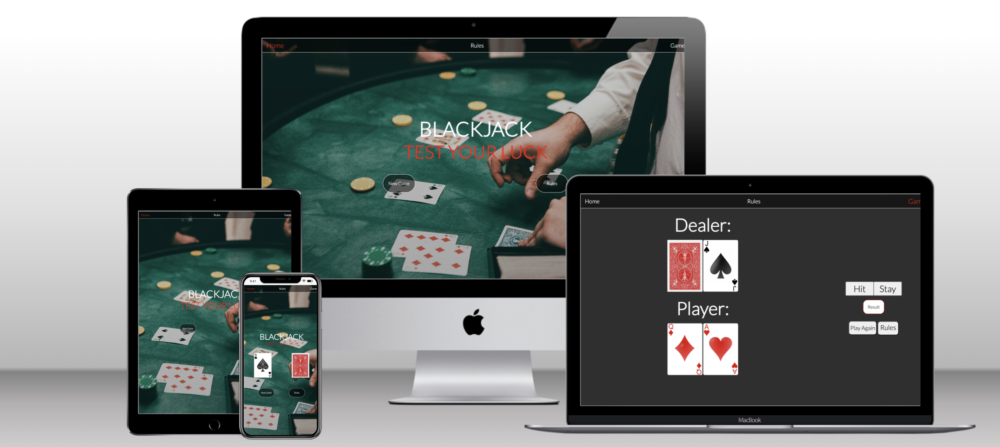

[Blackjack Live Link](https://noahdr17.github.io/Blackjack/)

## Features

### Site wide

* Navigation Menu
    * Holds a link to the: 
        * Home Page
        * Rules Page
        * Game Page
    * Responsive on all devices.
    * Allows users to easily navigate between pages on the site.
    * Features a hover affect to inform user when they are hovering over a nav link.
    * The link that is for the page you are currently on will be red instead of white, to provide an extra indication to the user for which page they are on.

* Favicon
    * Favicon will be displayed for every page
    * This will allow users to easily locate the website among other open tabs.

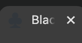

* 404 Error Page
    * Will open if a user uses a broken link.
    * Will allow the user to easily return to the website.

* Home Page 
    * Will contain a heading to describe the purpose of the website.
    * Will contain links to allow the user to navigate through the website.
    * Features two prompts for the user to either go to the rules page, or the game page, they will have a discreet hover affect to promote a positive user experience.

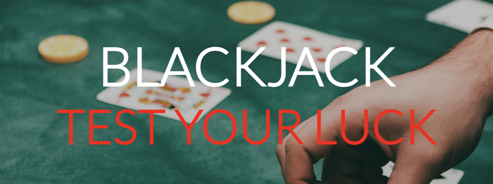

* Rules Page

    * The Rules page contains instructions for how the game is played.
    * There is a link at the bottom of the game instructions that takes you to the game page to start the game.

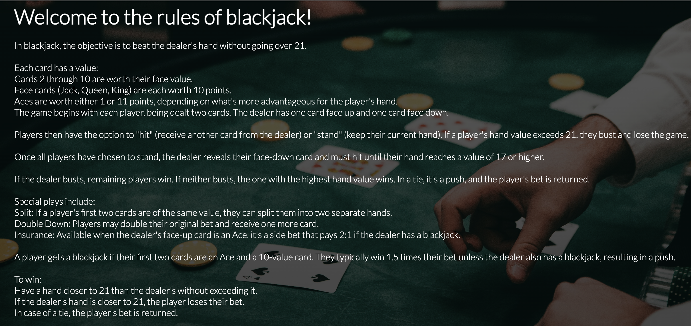

* Game Page

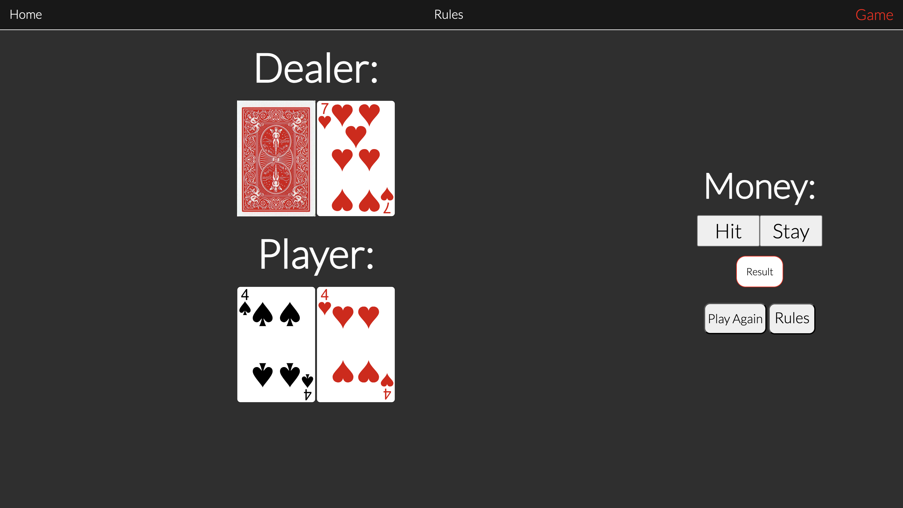

* The Game page contains the blackjack game itself, it contains:
    * Players hand
        * The player is dealt two cards at the beginning of every round.
    * Dealers hand 
        * The Dealer is dealt one card face up, and one card face down at the beginning of every round, the card that is face down is only revealed when the player has either gone bust (exceeded 21 points), or hit the stay button, at which point the game will check to see who has won.
    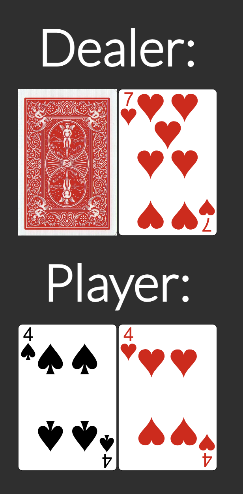
        
    * Hit/Stay Buttons
        * determines whether the player is dealt another card or if the round ends.
    * Play Again button
        * Starts the game again.
    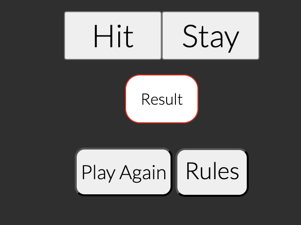
    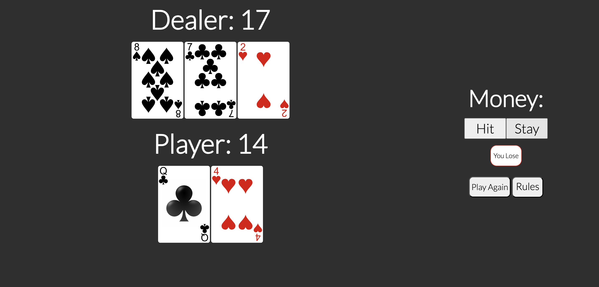
    * Rules Pop up button
        * Creates a pop up which displays the game instructions, instead of taking you to the rules page, which would reset the game status.
        * On mobile screen sizes the pop up will display at 100% width to give the text more space to take up, this lets the user not have to scroll so far down to read it all.
    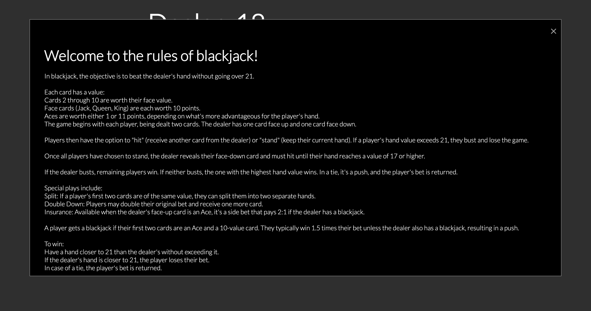
    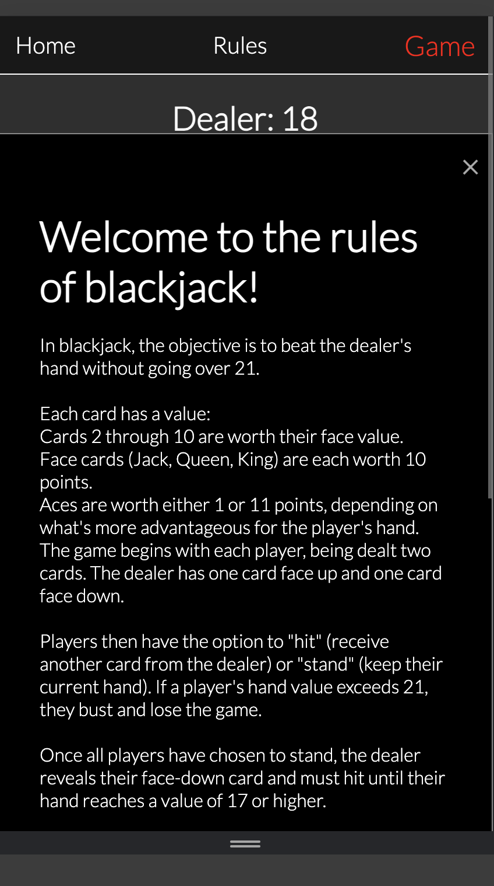
    * Result information box
        * contains the information stating whether or not the player has won, lost, or tied with the dealer.
    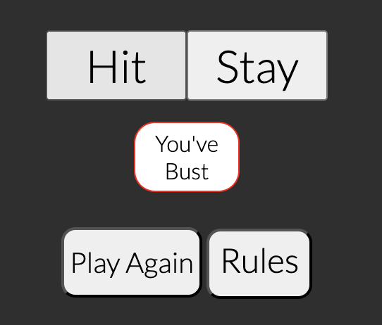
    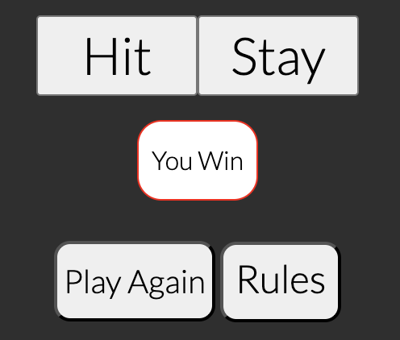
    

### Potential future feature implementations
* Future implementations:
    * Betting system.
    * Tally for how many times player or dealer has won.
    * Different types of card decks for customisability.

## Wireframe 
* Whole Wireframe
    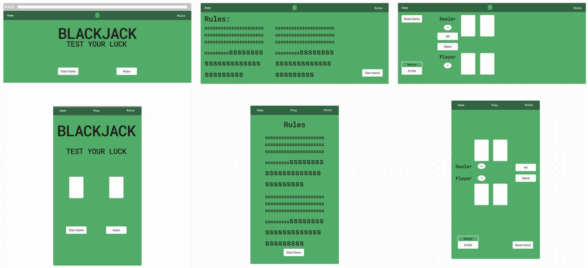

* Home Page 
    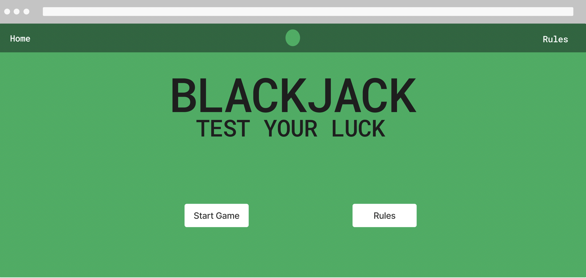

* Rules Page 
    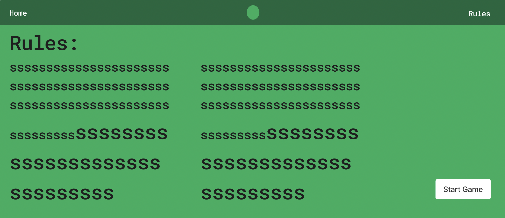

* Game Page 
    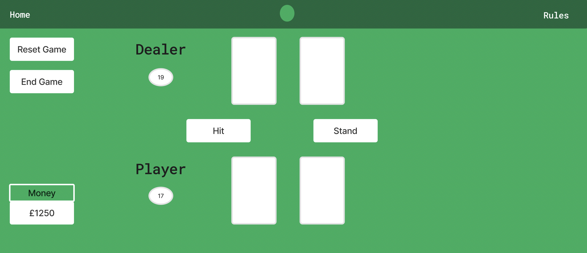

* 404 Page
        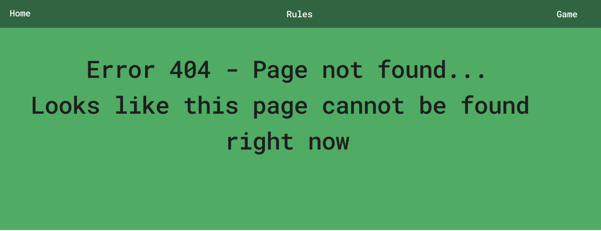

## Technologies Used

- Visual Studio Code
  - All development done through Visual Studio Code IDE
- GitHub
  - All files hosted and stored on GitHub, deployed through Git Pages.
- Git
  - Used to commit and push code from Visual studio Code IDE to GitHub
- HTML
  - Used throughout the development of the website
- CSS
  - Used throughtout the development of the website in an external file
- JavaScript
  - Used throughout the development of the game logic, and in the use of links in home page, in two external files, one for the blackjack game logic, and one for anything seperate to that.
- Font Awesome
  - Icons used throughout the website such as the social media icons where obtained from https://fontawesome.com/
- Google Fonts
  - Fonts used throughout the website where obtained from https://fonts.google.com/
- Favicon.io
  - Favicon used in website, imported from https://favicon.io/
- Figma
  - Wireframes were made through https://www.figma.com/
- Pexels
  - Images sourced from https://www.pexels.com/

## Testing 

### Responsiveness 

All pages have been tested for responsivesness from 320px in Chrome developer tools, and through https://www.websiteplanet.com/webtools/responsive-checker/ and are responsive as defined in [WCAG 2.1 Reflow criteria for responsive design](https://www.w3.org/WAI/WCAG21/Understanding/reflow.html)

- Steps to test

  - Navigate to [Blackjack](https://noahdr17.github.io/Blackjack/)
  - Open Developer toolss
  - Set width to 320px
  - Increase width incrementally while checking for unresponsiveness on every page

- Expected outcome:

  - Website is responsive across all screen sizes.
  - Images are not stretched or pixelated.
  - There is no horizontal scroll.
  - There is no overlap.

- Actual outcome: 
  - website behaved as expected

  - When opening the webpage through the safari app on an apple mobile phone, the colour of any text inside of buttons was blue, bug left unfixed as i could not find the solution.
  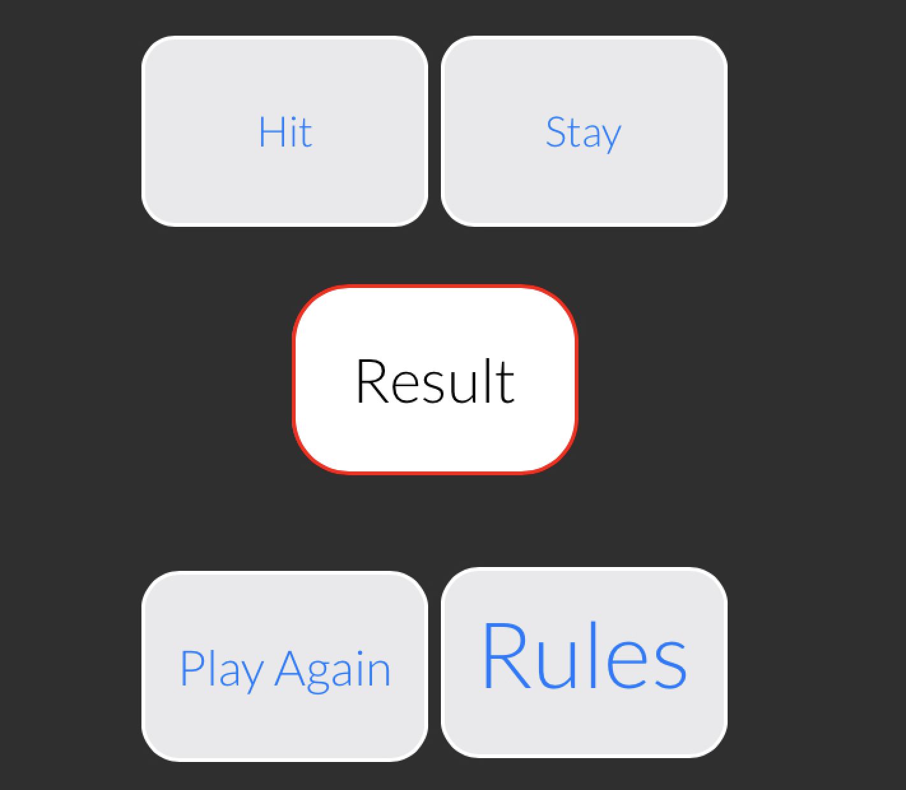

Website was also tested using Iphone SE, Ipad mini, air and pro, macbook air, and Galaxy fold.

### Accessibility

To test for accessibility i utilised the site, [Wave Accessibility](https://wave.webaim.org/)

- The testing was carried out to ensure these criteria are met:
  - colour contrast meets the specified criterea following the [WCAG 2.1 Contrast Guidelines](https://www.w3.org/WAI/WCAG21/Understanding/contrast-minimum.html).
  - All non text based elements and files have relavent alt text and aria-labels.
  - Colour contrast meet the minimum standards of [WCAG Contrast Guidelines](https://www.w3.org/WAI/WCAG21/Understanding/contrast-minimum.html).
  - Header levels are not missed or skipped to enable content to be relayed in the correct order.
  - All content is contained within relavent semantic markup.
  - Correct language attribute has been set for the html pages.

### Home Page

* DOCTYPE Declaration:
    * The document starts with the correct DOCTYPE html declaration for HTML5.

* HTML Element: 
    * The html tag includes the lang attribute, which is set to "en" (English).

* Head Section:
    * The head section includes:
        * Meta tags for character set and viewport settings.
        * A link to the CSS file.
        * Links to various favicon files.
        * A title tag to set the page title.

* Body Section:
    * The body tag includes an id attribute for identification and styling. A header tag contains the navigation links. The navigation links are inside a nav tag and use a tags with appropriate classes.

* Main Content:
    * The main content is wrapped inside a main tag with an id attribute. The title and subtitle are enclosed in a div with appropriate classes and use h1 and h2 tags. Images of cards are displayed within a div using img tags with appropriate classes, src, and alt attributes. Navigation links to "New Game" and "Rules" are included in a div with appropriate IDs and classes, structured with nested div and p tags.

* Script Inclusion:
    * The JavaScript file is included at the end of the body, which ensures the HTML content loads before any scripts run.

### Rules Page 
* DOCTYPE Declaration:
    * The document starts with the correct !DOCTYPE html declaration for HTML5.

* HTML Element:
    * The html tag includes the lang attribute, which is set to "en" (English).

* Head Section:
    * The head section includes meta tags for character set and viewport settings. Links to the CSS file and various favicons are correctly included. The title tag is properly used to set the page title.

* Body Section:
    * The body tag has an id attribute for identification and styling. A header tag is used to contain the navigation links, which is semantically appropriate. Navigation links are inside a nav tag, which is correct.

* Main Content:
    * The main content is wrapped inside a main tag, which is the correct semantic element for the main content of the page. The h1 tag is used for the main heading of the rules page. The content of the rules is enclosed in a div with an appropriate ID. The rules are structured with paragraphs (p) and lists (ul) for clarity.

* Additional Elements:
    * A div with the class centerAlign contains a link to start a new game. The link is enclosed in a div with appropriate IDs and classes for styling.

* Script Inclusion:
    * The JavaScript file is included at the end of the body, which is a best practice to ensure the HTML content loads before any scripts run.

### Game Page
* DOCTYPE Declaration:
    * The document starts with the correct DOCTYPE html declaration for HTML5.

* HTML Element:
    * The html tag includes the lang attribute, which is set to "en" (English).

* Head Section:
    * The head section includes meta tags for character set and viewport settings.Links to the CSS file and various favicons are correctly included.The title tag is properly used to set the page title.

* Body Section:
    * The body tag has an id attribute for identification and styling. A header tag is used to contain the navigation links, which is semantically appropriate. Navigation links are inside a nav tag, which is correct.

* Main Content:
    * The main game content is wrapped inside a main tag, which is the correct semantic element for the main content of the page.The use of div elements to structure the game containers is appropriate. The headings (h2) for the dealer and player sections are correctly used. The span elements inside the h2 tags are used for dynamic content updates (scores).

* Game Interaction Elements:
    * Buttons for game actions (Hit, Stay, Play Again, Rules) are included with appropriate IDs and classes. The modal for game rules is implemented using a combination of div elements and appropriate classes for styling and behavior.

* Script Inclusion:
    * The JavaScript file is included at the end of the body, which is a best practice to ensure  the HTML content loads before any scripts run.

### Errors Found in Accessibility Testing 

* There was no alt text description for the card images being dealt, as i was creating them in the javascript, and had forgot to add it into code.
    * Fix: "cardImg.alt = "Dealers card";"
        * This in the same way i added the src to the images, adds an alt description to the images being made.
    * This removed the error but created an alert, which stated that i had multiple images with the same alt description, "Dealers card" or "Players card", the only way i thought of to potentially fix this was by creating a function which checked the suit and value of each card popped out of the array and added into the src for the image, and based on its suit and value to have the alt description be a string combined with a variable which would hold that cards value and suit. However since this was only an alert and not an actual errror, i left it as is.

* No other errors found in Wave Accessibility testing.

## Functional Testing

- Navigation Bar
  - Testing was done by clicking each nav link on each page and ensuring they navigated to the correct link.
  

- Initial Load and UI Elements
    - Test: Verify that all UI elements (buttons, score displays, card images) load correctly.
    - How: Open the game in various browsers and check if all elements are visible and correctly   positioned.
    - Result: Everything worked as expected, asides from the buttons displaying blue text when opened in safari (solution not found).

- New Game Functionality
    - Test: Check if starting a new game initializes the game state properly.
    - How: Click the "New Game" button and ensure scores reset, new deck is made and shuffled, and the initial deal is correct.
    - Result: Everything worked as expected.

- Card Dealing
    - Test: Ensure that cards are dealt correctly to both the player and the dealer.    
    - How: Start a game and observe the initial deal, then use the "Hit" button to deal additional cards, and finish by checking the "stay" button correctly deals the dealers cards. Verify the cards shown match expected behavior.
    - Result: Everything worked as expected.

- Stay Button
    - Test: Ensure that clicking the "Stay" button ends the player's turn and the dealer plays according to the rules, and the results are correctly displayed to the screen.
    - How: Click "Stay" and verify the dealer's cards are revealed and they hit or stand according to the game rules compare the results displayed to the actual result of the game.
    - Result: Everything worked as expected.

- Score Calculation
    - Test: Verify that scores are calculated correctly for both player and dealer hands.
    - How: Manually calculate the expected score for given hands and compare with the displayed score.
    - Result: Everything worked as expected.

- Bust Condition
    - Test: Check that the game correctly identifies when the player or dealer busts.
    - How: Force a bust condition by repeatedly hitting until the score exceeds 21 and check the game response.
    - Result: Everything worked as expected.

- Win/Loss/tie Conditions
    - Test: Validate that the game correctly identifies and displays win, loss, and tie outcomes.
    - How: Play multiple games to each possible outcome and verify the displayed result matches the actual outcome.
    - Result: Everything worked as expected.

- Responsive Design
    - Test: Verify the game layout adapts correctly to different screen sizes.
    - How: Test on various devices (desktop, tablet, mobile) and window sizes to ensure the game remains playable.
    - Result: Everything worked as expected.

- Favicon and Manifest
    - Test: Check that favicons are displayed correctly and the web manifest is functioning.
    - How: Open the site on different devices and browsers to ensure the favicon appears and web manifest settings are applied.
    - Result: Everything worked as expected.

- Modal Windows
    - Test: Verify that modal windows (e.g., rules) open and close correctly.
    - How: Open the modal by clicking the link, check the content, and close it using the provided close button, or the optional click anywhere outside of the screen to close.
    - Result: Everything worked as expected, noticed that on smaller screen sizes there was alot of scrolling to read all the rules information, to fix this i made the width of the modal pop up 100% of the screen on smaller devices.

Expected Outcome:
After clicking a link, the user should be correctly navigated to the location of the link with no errors occuring.

Actual outcome: website behaved as expected, correctly navigating the user based on which link they clicked on.

### Validator Testing

- HTML: 
    - Any errors shown in validator where fixed until code returned no more errors when passed through.
    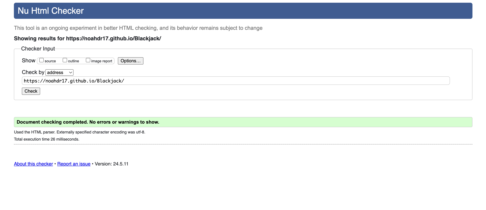 !

- CSS: 
    - Any errors shown in validator where fixed until code returned no more errors when passed through.
    [CSS Validated](docs/readme-images/css-validated.png)

- JavaScript: 
    - No errors shown in validator
    - Only warnings for using let as a declaration for variables
    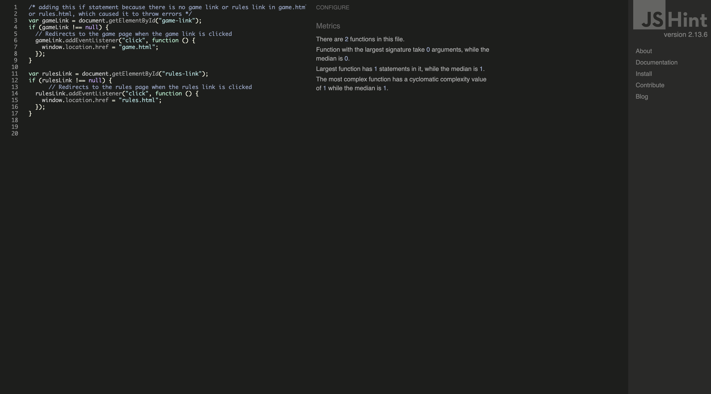 
    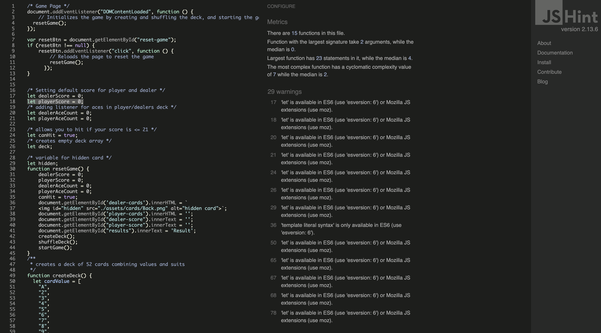

## Deployment
### Version Control

Site created using Visual Studio Code IDE.
Pushed to a GitHub repository called "Blackjack"

- These commands can be used to push code to a repository.
  - `git add <file>`
  - `git commit -m "commit message"`
  - `git push`

### Deployment to GitHub Pages

- The steps to Deploy to GitHub pages are as follows:
  - Open the Github repo.
  - navigate to settings.
  - select 'pages'.
  - select the main/master branch in the source section.
  - Click save.
  - A live link will be Displayed shortly after.

## Credits

### Content

All other content is owned and created by Noah Davis Reynolds

### Media
Images used for deck of cards were sourced from [source](https://boardgames.stackexchange.com/questions/51426/where-can-i-download-high-quality-images-of-poker-cards)
[Deck of Cards Source](docs/readme-images/deck-source.png)

Images sourced from [Pexels](https://www.pexels.com/)