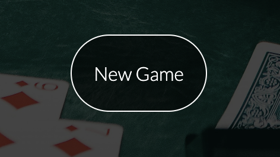

# Blackjack

Blackjack is a game designed to bring the excitement of classic blackjack to your browser. This single-player game replicates the authentic casino experience, allowing users to enjoy the thrill of blackjack online for fun.

[Blackjack Live Link](https://noahdr17.github.io/Blackjack/)

## Features

### Site wide

* Navigation Menu
    * Holds a link to the: 
        * Home Page
        * Rules Page
        * Game Page
    * Responsive on all devices.
    * Allows users to easily navigate between pages on the site.
    * Features a hover affect to inform user when they are hovering over a nav link.
    * The link that is for the page you are currently on will be red instead of white, to provide an extra indication to the user for which page they are on.

* Favicon
    * Favicon will be displayed for every page
    * This will allow users to easily locate the website among other open tabs.

* 404 Error Page
    * Will open if a user uses a broken link.
    * Will allow the user to easily return to the website.

* Home Page 
    * Will contain a heading to describe the purpose of the website.
    * Will contain links to allow the user to navigate through the website.
    * Features two prompts for the user to either go to the rules page, or the game page, they will have a discreet hover affect to promote a positive user experience.

* Rules Page

    * The Rules page contains instructions for how the game is played.
    * There is a link at the bottom of the game instructions that takes you to the game page to start the game.

* Game Page

* The Game page contains the blackjack game itself, it contains:
    * Players hand
        * The player is dealt two cards at the beginning of every round.
    * Dealers hand 
        * The Dealer is dealt one card face up, and one card face down at the beginning of every round, the card that is face down is only revealed when the player has either gone bust (exceeded 21 points), or hit the stay button, at which point the game will check to see who has won.
    
        
    * Hit/Stay Buttons
        * determines whether the player is dealt another card or if the round ends.
    * Play Again button
        * Starts the game again.
    
    
    * Rules Pop up button
        * Creates a pop up which displays the game instructions, instead of taking you to the rules page, which would reset the game status.
        * On mobile screen sizes the pop up will display at 100% width to give the text more space to take up, this lets the user not have to scroll so far down to read it all.
    
    
    * Result information box
        * contains the information stating whether or not the player has won, lost, or tied with the dealer.
    
    
    

### Potential future feature implementations
* Future implementations:
    * Betting system.
    * Tally for how many times player or dealer has won.
    * Different types of card decks for customisability.

## Wireframe 
* Whole Wireframe
    

* Home Page 
    

* Rules Page 
    

* Game Page 
    

* 404 Page
        

## Technologies Used

## Testing 

### Responsiveness 